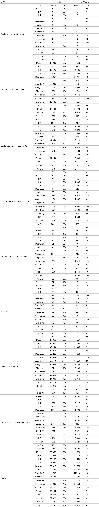
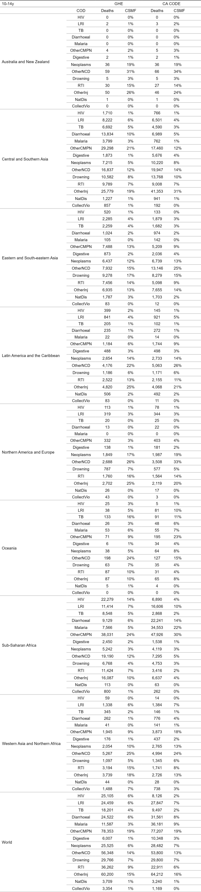

Tables
================

# Mean deaths and CSMFs for 2000-2021 by SDG region

## 5-9y

## 10-14y

## 15-19y F

## 15-19y M

Large differences in collective violence for Latin America and the
Caribbean, Northern America and Europe, Sub-Saharan Africa, and Western
Asia and Northern Africa (with GHE being much higher). Need to look into
this.

