Trends in age continuity
================

# CSMF comparison for 5-9y

### India

- GHE has higher CSMFs for LRI, OtherCMPN, and Diarrhoeal.
- CA CODE has higher OtherNCD, Digestive, Drowning, and OtherInj.

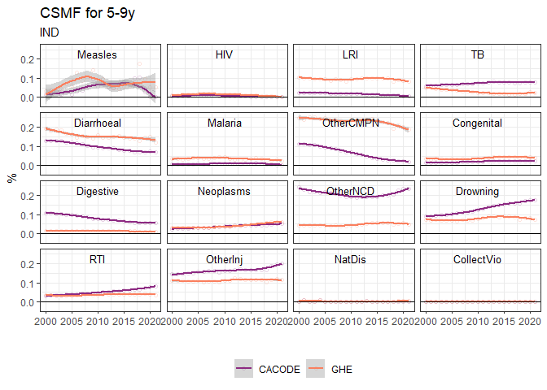<!-- -->

### Sub-Saharan Africa

Smoothed trend of national-level CSMFs for 5-9y in Sub-Saharan Africa.

- GHE tends to have higher HIV
- CA CODE has higher diarrhoeal, malaria, otherncd

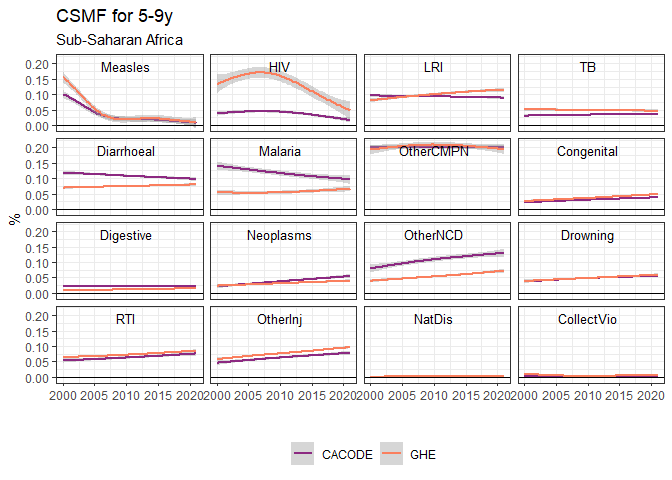<!-- -->

# Age continuity in cause-specific rates from 1-4y to 5-9y

- Values above zero mean an increase in the cause-specific rate from
  1-4y to 5-9y
- Values below zero mean a decrease in the cause-specific rate from 1-4y
  to 5-9y

### India

- For GHE, the rate of malaria increases from 1-4y to 5-9y. It is the
  opposite for CA CODE.
- For GHE, the rate of OtherNCD decreases from 1-4y to 5-9y. The rates
  are similar between age groups for CA CODE.
- For both GHE and CA CODE, the rate of OtherCMPN is lower in 5-9y than
  1-4y.
- For CA CODE, the cause-specific rate of TB was lower for 1-4y in the
  early 2000s, and higher for 5-9y in the late 2010s.

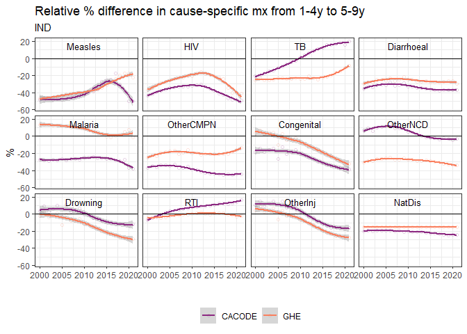<!-- -->

### Nigeria

- Similar age continuity for GHE and CA CODE.
- For both CA CODE and GHE, large decrease in malaria from 1-4y to 5-9y.
- For CA CODE, OtherInj were lower in 5-9y than 1-4y. For GHE the rates
  are similar between the two age groups.
- Big relative percent difference in Natural Disaster rates from 1-4y to
  5-9y for CA CODE. Very small real difference (see below).

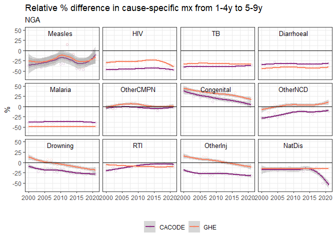<!-- -->

<!-- -->

### Eastern and South-eastern Asia

Smoothed trend of relative percent differences in national-level rates
from 1-4y to 5-9y.

- Similar age continuity for GHE and CA CODE.
- For GHE, RTI was higher in 5-9y than 1-4y. For CA CODE it was the
  opposite.
- Need to look into flat NatDis for GHE.

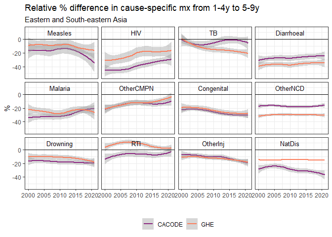<!-- -->

### Sub-Saharan Africa

Smoothed trend of relative percent differences in national-level rates
from 1-4y to 5-9y.

- HIV goes down from 1-4y to 5-9y for both GHE and CA CODE, but more for
  CA CODE.
- Big relative decrease in NatDis from 1-4y to 5-9y for CA CODE. Small
  real change.

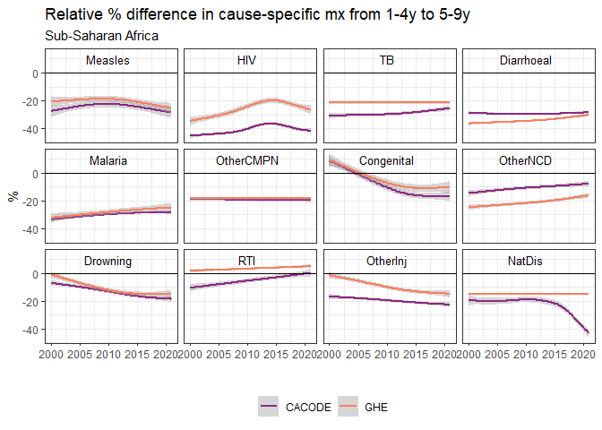<!-- -->

### World

Smoothed trend of relative percent differences in world rates from 1-4y
to 5-9y.

- Directionality of change between 1-4y and 5-9y is same for all
  cause-specific rates between CA CODE and GHE
- For GHE, there is less of a difference between age groups for HIV
- For CA CODE, there is less of a difference between age groups for
  OtherNCD

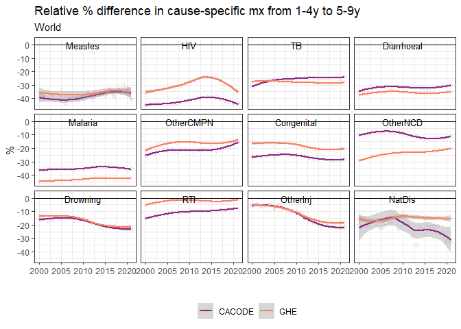<!-- -->

# CSMF comparison for 15-19y

### India

In India, CA CODE has much lower OtherCMPN and higher OtherNCD in 15-19y
than GHE.

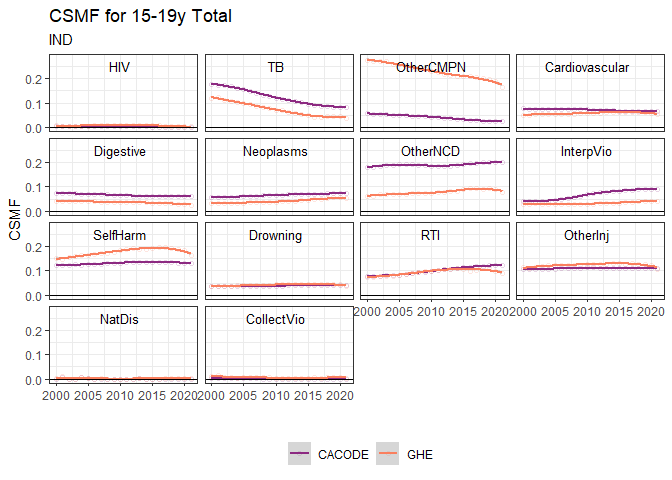<!-- -->

- In India, the GHE CSMFs essentially don’t change between 15-19y and
  20-24y.
- Because CA CODE has a lower CSMF for OtherCMPN in 15-19y (shown
  above), there is a large jump to the GHE CSMF (and rate) for 20-24y.
- Because CA CODE has a higher CSMF for OtherNCD in 15-19y (shown
  above), there is a large drop to the GHE CSMF (and rate) for 20-24y.

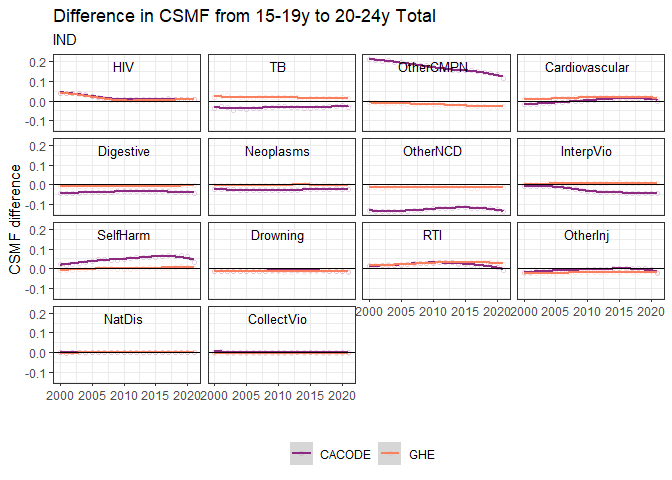<!-- -->

### Sub-Saharan Africa

Smoothed trend of national-level CSMFs for 15-19y.

- GHE has higher Maternal
- CA CODE has higher OtherNCD, InterpVio, SelfHarm
- GHE and CA CODE have different trends in the 15-19y CSMF for OtherCMPN

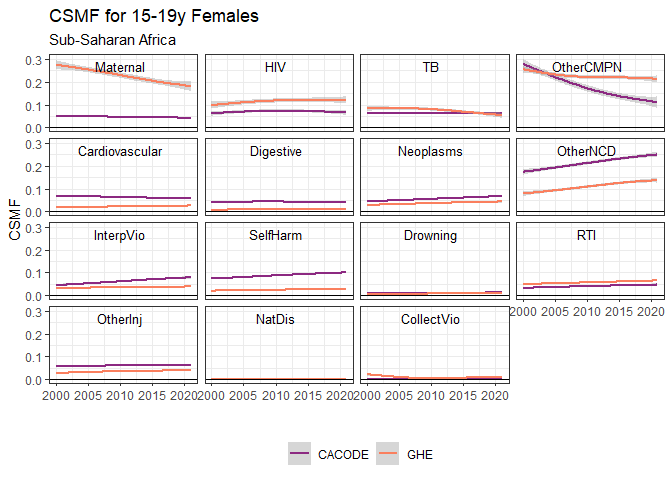<!-- -->

- Large differences in 15-19y CSMFs for InterpVio and CollectVio for
  males

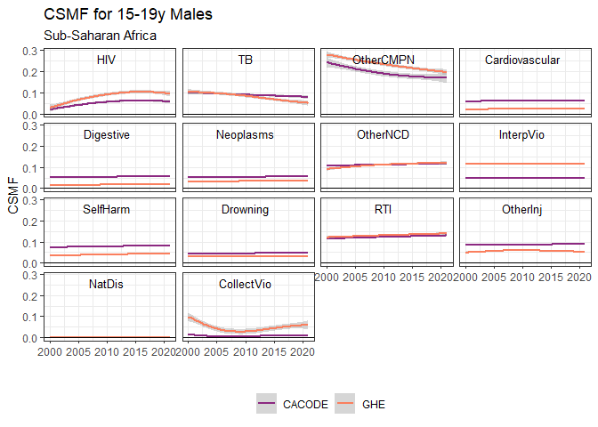<!-- -->

### Western Asia and Northern Africa

- The 15-19y CSMF for CollectVio is much higher in GHE, InterpVio higher
  in CA CODE.

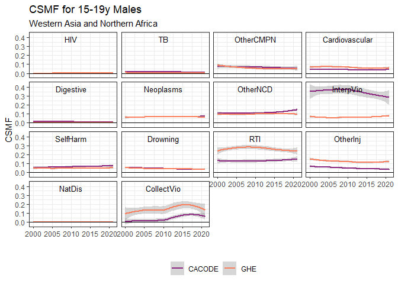<!-- -->

# Age continuity in cause-specific rates from 15-19y to 20-24y

- Values above zero mean an increase in the cause-specific rate from
  15-19y to 20-24y
- Values below zero mean a decrease in the cause-specific rate from
  15-19y to 20-24y

### Sub-Saharan Africa

Smoothed trend of relative percent differences in national-level rates
from 15-19y to 20-24y.

- For GHE, the rate of Cardiovascular, Digestive, Neoplasms, and
  SelfHarm increases from 15-19y to 20-24y. It is the opposite for CA
  CODE.
- For CA CODE, there are large relative increases in cause-specific
  rates of CollectVio from 15-19y to 20-24y.
  - This is due to the CA CODE CSMF for CollectVio being much lower in
    15-19y than GHE.

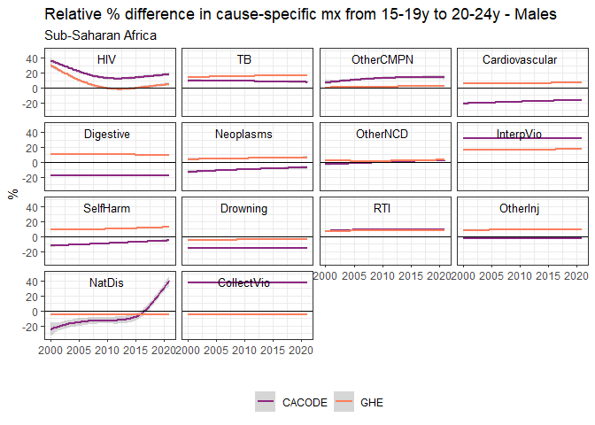<!-- -->

### World

Smoothed trend of relative percent differences in world rates from
15-19y to 20-24y.

- For GHE, the rate of Digestive, OtherNCD increases from 15-19y to
  20-24y. It is the opposite for CA CODE.
  - For Digestive, the real difference is rather small (see below)
- For CA CODE, there are large relative increases in CollectVio from
  15-19y to 20-24y.
  - In this case, the real difference in rates is notable (see below).

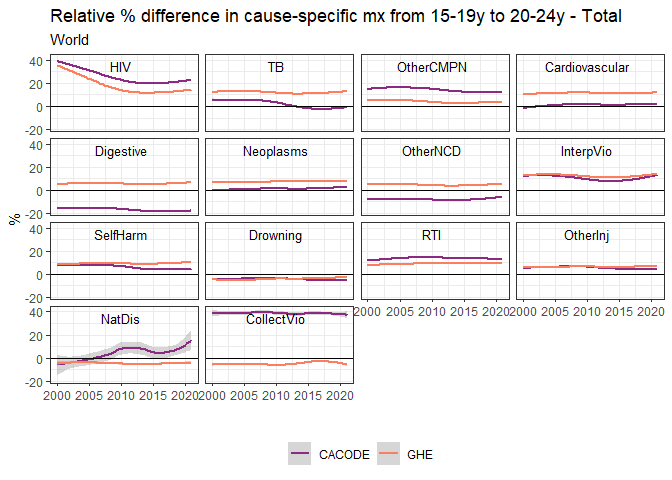<!-- -->

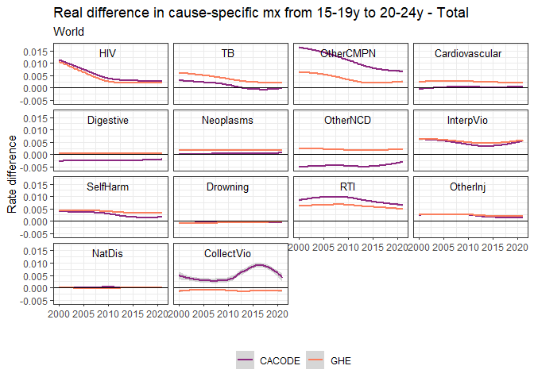<!-- -->
